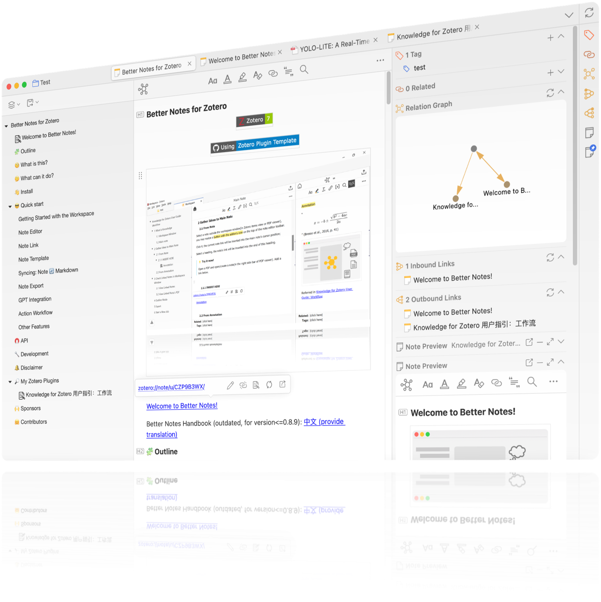

# Obsidian Bridge for Zotero

[](https://www.zotero.org)
[](https://github.com/YehuiLi-web/obsidian-zotero/releases)

<div align="center"></div>

Obsidian Bridge for Zotero 是一个运行在 Zotero 8 上的研究工作流插件。它把 Zotero 中的文献、元数据和受管 Markdown 笔记桥接到 Obsidian，同时尽量保留用户在 Obsidian 中持续维护的内容。

## 项目定位

这个仓库建立在 Better Notes 的代码基础之上，但当前产品目标已经收窄为 Obsidian 工作流：

- Zotero 是文献事实源
- Obsidian 是阅读、整理、链接与写作准备空间
- Markdown 是两者之间的桥接格式
- 插件只运行在 Zotero 侧，不提供单独的 Obsidian 插件

## 主要功能

- 将选中的 Zotero 条目同步为 Obsidian 友好的 Markdown 文献笔记
- 生成 YAML frontmatter、稳定文件名、Zotero 条目链接和 PDF 链接
- 在重复同步时保留用户维护区内容和非保留 frontmatter 自定义字段
- 可选输出元数据、摘要、摘要翻译、PDF 批注、隐藏信息和子笔记内容
- 提供 Metadata Preset、模板选择、预览面板、配置向导和测试写入
- 支持打开 Obsidian、修复联动映射、重同步已联动笔记和初始化 Dashboard
- 对阅读状态、评分、标签等少量字段提供受控回写能力

## 受管同步模型

默认更新策略是 `managed`。在这个模式下：

- 插件会更新 frontmatter 和 `GENERATED` 托管区
- 用户在 `USER` 区中写的内容会尽量被保留
- 用户自定义的非保留 frontmatter 字段会尽量被保留
- 只有在明确选择 `overwrite` 时，插件才会重建整篇文档
- `skip` 会跳过已经存在的目标文件

### 标签字段约定

- `zotero_tags` 是 Zotero 标签的受控回写入口
- `tags` 主要用于 Obsidian 原生标签、Dataview/Bases 查询和本地工作流整理
- 当两者同时存在时，插件回写 Zotero 时优先使用 `zotero_tags`
- 只有旧文件缺少 `zotero_tags` 时，才会回退读取 `tags`

## 兼容性

- 插件名称：`Obsidian Bridge for Zotero`
- 目标 Zotero 版本：Zotero 8
- manifest 最低版本：`8.0-beta.21`
- 发布产物：`obsidian-bridge-for-zotero.xpi`
- 仓库地址：`https://github.com/YehuiLi-web/obsidian-zotero`
- Obsidian 侧不要求额外安装插件
- Dataview 和 Bases 仅在 Dashboard 工作流中作为增强体验，不是主同步链路依赖

## 安装

从 GitHub Releases 下载：

- [Version 3.0.3](https://github.com/YehuiLi-web/obsidian-zotero/releases/download/v3.0.3/obsidian-bridge-for-zotero.xpi)
- [All releases](https://github.com/YehuiLi-web/obsidian-zotero/releases)

然后在 Zotero 中打开 `工具 -> 插件`，点击右上角齿轮图标，选择“Install Add-on From File”，再选中下载的 `.xpi` 文件。

如果浏览器尝试直接打开 `.xpi`，请改用“另存为”。

## 快速开始

1. 在 Zotero 8 中安装插件并重启 Zotero。
2. 打开插件设置，先配置 Obsidian 的 `Vault` 根目录和文献笔记目录。
3. 可选填写 Obsidian 可执行文件路径；不填写也可以同步文件，但“同步后自动打开 Obsidian”可能无法工作。
4. 运行“配置向导”或“测试写入一个文件”，确认插件对 Vault 有写入权限。
5. 选中一篇或多篇常规 Zotero 条目，执行同步到 Obsidian。
6. 在 Obsidian 中继续维护 `USER` 区内容，之后按需回到 Zotero 重新同步或修复联动映射。

## 开发

### 环境要求

- Node.js 20+
- npm
- 运行时测试需要本地安装 Zotero 8

### 常用命令

```bash
npm install
npm run build
npm run test:preflight
npm run test
npm start
```

- `npm run build` 会打包插件并生成 `.xpi`
- `npm run test:preflight` 会检查运行时测试所需的 Zotero 可执行文件
- `npm run test` 会先执行 preflight，再运行 Zotero 集成测试
- `npm start` 会启动 scaffold 的开发模式

### 运行时测试说明

运行时测试依赖 `ZOTERO_PLUGIN_ZOTERO_BIN_PATH`。如果脚本没有自动找到 Zotero，可手动设置：

```powershell
$env:ZOTERO_PLUGIN_ZOTERO_BIN_PATH = 'C:\Program Files\Zotero\zotero.exe'
npm.cmd run test
```

构建产物默认输出到 `build/obsidian-bridge-for-zotero.xpi`。

### Windows 说明

- 如果 PowerShell 阻止执行 `npm.ps1`，可以改用 `npm.cmd run <script>`
- 常见 Zotero 路径为 `C:\Program Files\Zotero\zotero.exe`

## 当前边界

- 这不是 Better Notes 全量能力的重新发布，而是聚焦 Obsidian 工作流的分支
- Zotero 仍然是文献事实源，Obsidian 不是主数据库
- 不是所有 frontmatter 字段都会双向同步，只支持少量受控字段
- Dashboard 工作流依赖 Dataview 或 Bases 时体验更完整，但主同步链路不依赖它们

## 历史说明

这个仓库继承了 Better Notes 的部分工作区、模板、导入导出和编辑器基础设施，因此你仍会在源码和旧文档中看到 Better Notes 的历史痕迹。当前对外定位仍然是 Obsidian Bridge for Zotero。
