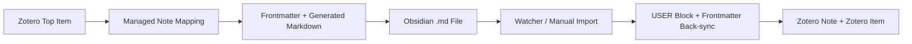

# Obsidian Bridge for Zotero 项目分析

## 一、执行摘要

这个仓库已经不再只是原始 `zotero-better-notes` 的轻量改皮，而是一个明显朝着“Zotero 为事实源，Obsidian 为阅读与综合工作台”的方向收敛的产品分支。当前版本的核心能力已经不是通用笔记增强，而是：

- 为 Zotero 条目生成受管控的 Obsidian 文献笔记
- 在 Zotero 与 Obsidian Markdown 之间做双向同步
- 用 `GENERATED` / `USER` 分区保护用户手写内容
- 把状态、评分、标签等 frontmatter 反写回 Zotero
- 基于 Dataview / Bases 自动生成研究 Dashboard

从“能不能用”看，这个项目已经具备真实工作流可用性；从“能不能长期维护”看，它也已经积累出一批需要收口的工程和产品债务。最重要的结论有四条：

1. 当前代码主线已经形成独立的 Obsidian Bridge 能力栈，不再只是依赖 Better Notes 的原有导出功能。
2. `npm run build` 当前可以通过，旧分析文档里“TypeScript 编译已坏”的结论已经过时。
3. `npm run test` 当前没有进入业务断言阶段，而是在临时安装扩展时失败，说明测试链路存在安装或打包层面的阻塞点。
4. 现在最大的问题不是“功能缺失”，而是“品牌/文档漂移 + 测试不闭环 + 源码区历史产物残留 + 大文件维护成本”。

## 二、分析依据

这次重写基于仓库现状逐项核实，主要证据来源如下：

- 文档：`README.md`、`docs/obsidian-bridge-mvp.md`
- 入口与生命周期：`src/addon.ts`、`src/hooks.ts`、`src/api.ts`
- Obsidian 核心模块：`src/modules/obsidian/*.ts`
- 同步与导入导出：`src/modules/export/markdown.ts`、`src/modules/import/markdown.ts`、`src/modules/sync/*.ts`
- 偏好设置与界面：`addon/chrome/content/preferences.xhtml`、`src/modules/obsidian/prefsUI.ts`
- 自动化测试：`test/tests/*.ts`
- 构建验证：本地执行 `npm run build`、`npm run test`

### 客观统计

- `src/` 下共有 `118` 个 `.ts` 文件
- `src/` 下同时残留 `99` 个 `.js` 文件
- `addon/locale/` 下共有 `73` 个 `.ftl` 文件，覆盖 `6` 个语言目录
- `test/tests/` 下共有 `7` 个测试文件，合计 `61` 个 `describe/it` 用例
- 最大的几个核心文件：
  - `src/modules/obsidian/prefsUI.ts`: `3457` 行
  - `src/modules/obsidian/settings.ts`: `1425` 行
  - `src/modules/obsidian/sync.ts`: `935` 行
  - `src/modules/obsidian/managed.ts`: `723` 行

## 三、项目定位与产品边界

### 3.1 当前真实定位

从 `package.json`、`manifest`、Obsidian 模块、偏好设置页和测试内容来看，当前项目的真实定位是：

> 一个面向 Zotero + Obsidian 研究工作流的桥接插件，让用户在 Zotero 中维护文献事实，在 Obsidian 中完成阅读、结构化整理、链接、查询与看板分析。

这比原始 Better Notes 更聚焦，也更有明确的目标用户。

### 3.2 与上游 Better Notes 的关系

当前仓库仍然继承了 Better Notes 的大量基础设施，包括：

- Note editor 增强
- Template 系统
- Markdown/Docx/PDF 导出管线
- Workspace / relation / link 等旧功能

但新功能中心已经明显转移到 `src/modules/obsidian/`，并通过 `hooks.ts` 在启动阶段直接注册。

### 3.3 当前边界

当前分支已经做了很多 Obsidian 深度能力，但还没有完全“产品收口”。因此它现在处于一个中间态：

- 底层实现上，已经是 Obsidian-first
- 对外文档和品牌上，仍然带有明显 Better Notes 遗留

这也是当前最大的外部认知问题之一。

## 四、已验证的核心能力

## 4.1 受管控的 Obsidian 文献笔记

核心能力已经不是“把 Zotero note 导出成 md”，而是“为 Zotero 条目生成一类受管理的 Obsidian 文献笔记”。

已验证机制包括：

- 每个顶层条目会映射到一个受管理 note，映射关系保存在 `obsidian-bridge-map.json`
- 若 Zotero note 不存在但 Obsidian 文件仍在，系统可尝试从 Markdown 恢复受管理 note
- 文件名采用稳定命名规则，核心模板为 `{{title}} -- {{uniqueKey}}`
- Markdown 内容被拆分为：
  - `BEGIN GENERATED` 到 `END GENERATED`
  - `BEGIN USER` 到 `END USER`

这个设计直接决定了项目的产品护城河：它不是一次性导出，而是有状态的、可恢复的、可保护用户编辑区的桥接系统。

## 4.2 Frontmatter 生成与保护

`frontmatter.ts` 和 `managed.ts` 已经形成较成熟的 frontmatter 方案：

- 固定写入桥接识别字段：
  - `bridge_managed`
  - `bridge_schema`
  - `$version`
  - `$libraryID`
  - `$itemKey`
  - `zotero_key`
  - `zotero_note_key`
- 可配置字段包括：
  - 标题翻译与别名
  - 文献类型
  - 日期与年份
  - DOI
  - Citation Key
  - 刊物
  - Zotero item / PDF link
  - 作者、分类、Zotero 标签、评分
- 自定义 frontmatter 字段不会被无脑覆盖，保留策略已经在 `mergeManagedFrontmatter()` 中实现
- 用户在 Obsidian 中维护的 `project`、`topic`、`method` 等字段可以被持续保留

这说明当前系统不是简单模板渲染，而是围绕“可持续演化的 frontmatter 模型”在工作。

## 4.3 双向同步

双向同步链路已经具备完整闭环：

- Zotero -> Markdown：
  - `saveMD()` / `syncMDBatch()`
  - managed note 会优先走 `renderManagedObsidianNoteMarkdown()`
- Markdown -> Zotero：
  - `fromMD()`
  - 对 managed note 只导入 `USER` 区，避免生成区反向污染 Zotero 笔记正文
- Zotero item 变化会触发重同步：
  - 条目修改
  - 标签变化
  - collection-item 变化
- Obsidian 文件变化也可以回流：
  - `watcher.ts` 通过轮询扫描文件更新时间
  - 默认扫描间隔 `2000ms`
  - 去抖时间 `1200ms`

同步策略也已经产品化：

- `managed`: 只更新托管区，保护用户区
- `overwrite`: 全量覆盖
- `skip`: 如果目标文件已存在则跳过

## 4.4 Frontmatter 回写 Zotero

这是当前项目里很有价值、也很容易被忽视的一层：

- `reading_status` / `status` 可写回 Zotero `extra`
- `rating` 可写回原生 rating 字段，若不可用则写回 `extra`
- `tags` / `zotero_tags` 可反向同步到 Zotero tag

这让 Obsidian 不只是“输出端”，而是工作流中的一个编辑面板。

## 4.5 子笔记嫁接

`childNotes.ts` 和 `managed.ts` 说明项目已经支持一个很具体的 AI/研究流程能力：

- 按标签匹配条目的 child notes
- 将命中的 child notes 嵌入到受管理文献笔记
- 对多条匹配结果可弹窗选择
- 排除关系会被记住

默认偏好里甚至已经包含中文和 emoji 风格的 AI 标签规则，说明这个能力是为实际研究工作流设计过的，而不是概念功能。

## 4.6 批注纳入文献笔记

系统已经支持把 PDF annotation 纳入 managed note：

- 提取高亮、图像批注、页码、颜色、排序索引、文本、评论、标签
- 以标准 Markdown 小节形式生成 `## Annotations`
- 可通过偏好开关关闭

这对 Zotero + Obsidian 的阅读流是一个非常关键的桥梁能力。

## 4.7 Dashboard 与 Bases

Dashboard 不是停留在规划阶段，而是已经有落地实现：

- 自动生成：
  - `Research Dashboard.md`
  - `Topic Dashboard.md`
  - `Reading Pipeline.base`
- 依赖 Dataview / Bases 做查询和聚合
- 如果目标文件没有 managed marker，则不会覆盖用户已有自定义 dashboard

这部分能力让产品从“同步工具”升级成“研究工作流操作台”。

## 4.8 偏好设置与引导体验

Obsidian 设置页已经远超一个普通“输入路径”的设置面板。

实际已实现的体验包括：

- Obsidian app 路径、vault、notesDir、assetsDir、dashboardDir 配置
- 自动检测 vault
- setup wizard
- 测试写入连接文件
- 文件名与 frontmatter 预览
- 同步范围选择
- 更新策略选择
- 内容开关：metadata / abstract / hidden info / annotations / child notes
- metadata preset 管理
- child note bridge 规则
- dashboard 初始化和 repair 操作

这部分是现阶段最完整的用户界面资产。

## 4.9 同步历史与修复

项目已经具备维护型产品该有的恢复能力：

- 同步历史上限 `250` 条
- 支持记录导出/导入前后差异
- sync manager 窗口中已有历史表与 preview
- `repairObsidianManagedLinks()` 可以：
  - 恢复丢失映射
  - 重建 sync status
  - 从 Markdown 反向重建被删除的 managed note
  - 处理多个候选 note 的冲突

这一层显著提升了“桥接型产品”的可信度。

## 五、架构拆解

## 5.1 启动与生命周期

`hooks.ts` 是当前插件的业务总线。启动时会做这些事：

- 初始化 locale
- 注册菜单、note link、editor hook、preference window
- 初始化 relation、workspace、notify
- 初始化 Obsidian 存储
- 初始化 sync list 和 sync history
- 开启周期同步与文件 watcher
- 在主窗口加载后初始化 guide、prefs UI 和 setup wizard

这说明 Obsidian Bridge 已经被放进插件主生命周期，而不是一个边缘模块。

## 5.2 核心模块职责

可以把 `src/modules/obsidian/` 理解为 6 个子系统：

| 子系统 | 主要文件 | 作用 |
| --- | --- | --- |
| 设置与持久化 | `settings.ts` | 偏好、默认值、vault 检测、JSON 持久化、metadata preset |
| 渲染模型 | `markdown.ts`、`frontmatter.ts` | 上下文提取、callout、frontmatter、用户区提取 |
| 受管控笔记 | `managed.ts` | managed note 判定、source hash、生成 markdown、frontmatter 合并 |
| 同步编排 | `sync.ts` | 创建/恢复/导出/open/repair/resync |
| Dashboard | `dashboard.ts` | Dataview 与 Bases 文件生成 |
| 偏好设置 UI | `prefsUI.ts` + `prefsUI/*` | 配置向导、交互、预览、设置绑定 |

## 5.3 数据流

## 六、工程状态判断

## 6.1 构建状态

本地验证结果：

- `npm run build`: 通过
- 构建产物 `build/addon/manifest.json` 已正确替换占位符
- 打包成功生成 `build/obsidian-bridge-for-zotero.xpi`

因此“当前无法编译”的结论不成立。

## 6.2 测试状态

本地 `npm run test` 失败，但失败点不是具体业务测试断言，而是测试运行器在临时安装扩展时报告：

- `Could not install add-on`
- `homepage_url: __homepage__ is not a valid URL`

需要注意的是：

- 源码里的 `addon/manifest.json` 仍是模板占位符，这是正常源文件形态
- 构建后的 `build/addon/manifest.json` 已经是合法值

因此更准确的判断应该是：

> 当前测试链路被“测试模式下的扩展安装/打包步骤”阻断，而不是已经证明核心 Obsidian 同步逻辑本身失效。

这依然是高优先级问题，因为它让自动回归验证失去作用。

## 6.3 国际化状态

优点：

- 已覆盖 `de`、`en-US`、`it-IT`、`ru-RU`、`tr-TR`、`zh-CN`
- Obsidian 相关 key 已经大量进入 `.ftl`
- note 模板标题、frontmatter 选项、设置页内容已经做了较系统的 i18n

不足：

- 构建时仍有 `close-shortcut` 缺失告警
- 偏好页和产品文案里仍混有较多直接写死文本

整体判断：i18n 已经从“零散补丁”进入“体系化推进”阶段，但还没有完全收口。

## 6.4 源码整洁度

### 明显问题

- `src/` 下仍残留 `99` 个 `.js` 文件
- 大量 TS/JS 同名并存，会增加误读、误导入和代码搜索噪音
- `prefsUI.ts` 仍然过大，即便已拆出 `layout.ts` 与 `style.ts`，主文件仍是明显的 God File

### 正向信号

- Obsidian 功能已经集中到独立目录，不再散落全仓库
- 存储已经开始从 `Prefs` 向 Zotero data 目录 JSON 文件迁移
- 测试已经覆盖 managed note、dashboard、repair、frontmatter merge 等关键路径

## 七、当前最突出的产品与工程问题

## P0：必须优先解决

### 1. 文档、品牌和兼容性信息严重漂移

已验证的漂移包括：

- `README.md` 仍以 `Better Notes for Zotero` 为主标题
- `package.json` 与构建产物已经是 `Obsidian Bridge for Zotero`
- `README` 安装说明仍带有上游版本叙事
- `manifest` 最低版本要求是 `8.0-beta.21`，但 README 上仍保留 `Zotero 7/8` 的认知
- 偏好页 About 区链接仍指向上游 Better Notes 仓库与讨论区

这会直接导致：

- 用户装错版本
- 用户对产品能力产生误解
- issue 报告和社区入口混乱

### 2. 测试链路不闭环

即使主功能不错，只要 `npm run test` 不能稳定跑通，后续改动就缺乏可靠回归机制。

### 3. 源码目录历史产物残留

`src` 下同时存在大量 `.ts` 与 `.js`，这是很现实的维护成本问题。

## P1：应尽快排期

### 4. 偏好设置文件过大

`prefsUI.ts` 已经超出舒适维护范围。当前项目最复杂、最容易继续膨胀的地方就是设置 UI。

### 5. 文件名规则存在配置漂移

已验证现象：

- `addon/prefs.js` 中的默认值是 `{{title}} - {{year}}`
- `settings.ts` / `paths.ts` 实际生成逻辑使用的是 `{{title}} -- {{uniqueKey}}`
- `getManagedFileNamePattern()` 当前返回固定规则，而不是读取用户偏好

这意味着“用户可配置文件名模板”在产品表述与实际实现之间仍有缝隙。

### 6. 错误提示仍有原生 `alert()`

在 `obsidian/sync.ts` 等路径中仍能看到直接 `alert(String(e))`。这不适合作为长期产品的错误反馈方式。

## P2：中期优化

### 7. Watcher 仍是轮询而非原生监听

当前 watcher 已经存在，但本质上是轮询扫描。对大库来说，性能和实时性仍有改进空间。

### 8. 仍保留较多 Better Notes 旧能力包袱

这不是 bug，但会在未来造成产品战略分岔：

- 是继续做一个“更强的 Better Notes fork”
- 还是彻底收敛成“Obsidian Bridge for Zotero”

现在的代码和文档对这个问题还没有最终回答。

## 八、对旧分析文档的纠偏

为了避免后续讨论继续建立在过时前提上，这里明确纠正旧文中的几类判断：

1. “TypeScript 编译当前存在报错”  
当前本地 `npm run build` 已通过，这个结论已失效。

2. “还没有文件 watcher / 双向联动基础”  
当前项目已经有文件 watcher、USER block 导入、frontmatter 回写和 repair 流程。

3. “Dashboard 主要还在规划阶段”  
Dashboard 与 `.base` 文件已经实际生成，并且有测试覆盖。

4. “只是做了少量 Obsidian 定制”  
从设置、同步、恢复、frontmatter、Dashboard 到 API，当前已经形成独立能力面。

旧分析里关于“大文件问题”“源码污染”“用户提示体验一般”等判断仍然成立，但需要基于新状态重新排序优先级。

## 九、建议的下一阶段动作

## 阶段一：先把产品说清楚、跑通、可验证

- 统一产品名称、README、manifest、About 区链接和最低兼容版本描述
- 修复 `npm run test` 的扩展安装阻塞问题
- 清理 `src/` 中的历史 `.js` 产物

## 阶段二：把桥接能力打磨成稳定产品

- 拆分 `prefsUI.ts`
- 统一文件名规则的“展示、配置、实际生效”三层逻辑
- 全面替换 `alert()` 为一致的 hint / notification 机制
- 补齐对 setup wizard、metadata preset、watcher 的测试

## 阶段三：再考虑扩展性

- 评估是否引入原生文件监听
- 明确 frontmatter 反写 Zotero 的字段边界
- 设计更清晰的“上游继承功能”与“Bridge 原生功能”分层

## 十、最终判断

这是一个已经越过“概念验证”阶段的项目。

它的真正问题不是功能太少，而是：

- 产品身份还没有完全统一
- 工程收口还没做完
- 自动验证链路还不稳

如果下一步把“品牌/文档统一、测试恢复、目录清洁、设置页拆分”这四件事做完，这个仓库就会从“功能很强的 fork”进入“可以稳定演进的独立产品”阶段。
