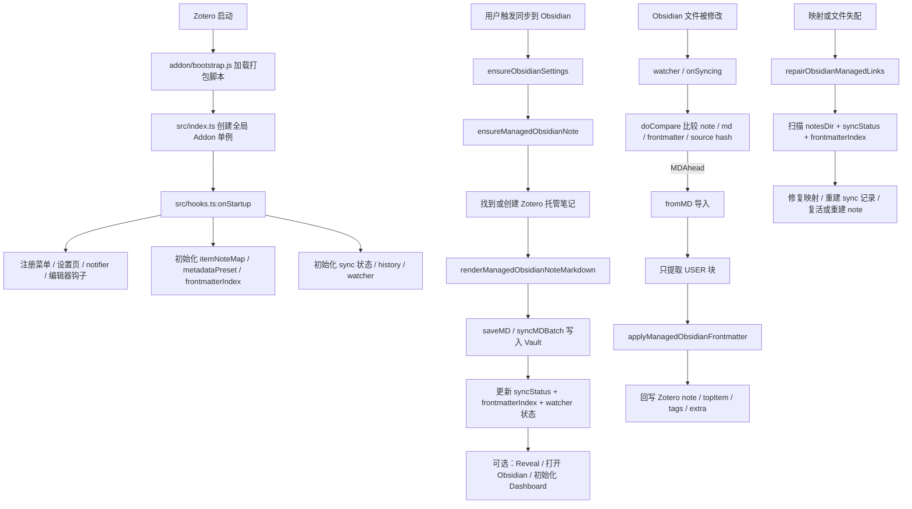

# Obsidian Bridge 联动逻辑分析

> [!summary]
> 这个仓库的核心不是“给 Obsidian 写一个插件”，而是“在 Zotero 侧建立一套稳定的 Markdown 托管同步协议”，然后用文件系统、URI、frontmatter、同步状态和修复机制把 Zotero 与 Obsidian 连起来。

## 1. 一句话结论

这个项目当前的 Obsidian 联动本质上是一个运行在 Zotero 8 内部的桥接层：

- Zotero 是数据事实源和主业务入口。
- Obsidian 只是目标 Vault、目标文件结构和打开 URI 的承载方。
- 真正的联动协议由 Markdown 文件、YAML frontmatter、注释标记块、同步状态、映射表和修复逻辑组成。
- 因为没有 Obsidian 侧插件，所以所有“联动”都要落在文件级别，而不是运行时 API 级别。

## 2. 总体架构



## 3. 代码分层

| 层级 | 关键文件 | 作用 |
| --- | --- | --- |
| 启动入口 | `addon/bootstrap.js`, `src/index.ts`, `src/hooks.ts` | 把 Zotero Add-on 生命周期接到业务逻辑上 |
| 用户入口 | `src/modules/menu.ts`, `src/modules/preferences/*` | 菜单、右键、设置页、向导、预览面板 |
| Obsidian 配置与路径 | `src/modules/obsidian/settings.ts`, `paths.ts` | 解析 Vault 路径、默认目录、打开 URI、文件名规则 |
| 托管 Markdown 协议 | `src/modules/obsidian/frontmatter.ts`, `markdown.ts`, `managed.ts` | 生成 frontmatter、托管区、用户区、回写逻辑 |
| 联动同步主链路 | `src/modules/obsidian/sync.ts` | 同步到 Vault、打开 Obsidian、修复映射、重同步 |
| 通用同步引擎 | `src/modules/sync/api.ts`, `hooks.ts`, `watcher.ts`, `history.ts` | 比较 note/md 状态、定时同步、文件监视、历史记录 |
| 导入导出桥 | `src/modules/export/markdown.ts`, `src/modules/import/markdown.ts` | 识别托管模式并走特化导出/导入 |
| 稳定性支撑 | `src/modules/obsidian/itemNoteMap.ts`, `frontmatterIndex.ts` | 维护 Zotero 条目与 Markdown 文件之间的稳定关联 |
| 扩展能力 | `dashboard.ts`, `metadataPreset.ts`, `childNotes.ts`, `translation.ts` | Dashboard、元数据视图、子笔记桥接、缺失翻译补全 |

## 4. 启动时做了什么

### 4.1 生命周期接入

插件通过 `addon/bootstrap.js` 注册 chrome 资源，然后加载打包后的主脚本。`src/index.ts` 会创建全局 `Addon` 单例，把实例挂到 `Zotero[config.addonInstance]` 上，后续所有模块都通过这个全局实例共享状态。

### 4.2 `onStartup` 的关键动作

`src/hooks.ts` 的 `onStartup()` 在 Zotero 初始化完成后执行以下动作：

1. 初始化本地化和进度窗图标。
2. 注册顶部菜单、右键菜单、设置面板、编辑器钩子、Reader 批注按钮。
3. 初始化 Obsidian 持久化状态：
   - `itemNoteMap`
   - `metadataPresetLibrary`
   - `frontmatterIndex`
4. 初始化通用同步系统：
   - sync note 列表
   - sync history
   - 周期性同步 timer
   - 文件 watcher
5. 为每个 Zotero 主窗口做 UI 注入，并在首次使用时触发 Obsidian 配置向导。

### 4.3 重要观察

> [!note]
> Obsidian 联动不是独立的第二套插件框架，而是“复用 Better Notes 时代留下的通用同步引擎”，再在导入导出层注入 Obsidian 的托管规则。

这点非常关键，因为后面很多行为都不是直接在 `obsidian/sync.ts` 完成，而是借用了：

- `src/modules/sync/hooks.ts` 的比较与调度
- `src/modules/export/markdown.ts` 的写文件入口
- `src/modules/import/markdown.ts` 的读文件入口

## 5. 用户可以从哪里触发联动

### 5.1 菜单与右键

`src/modules/menu.ts` 注册了多条 Obsidian 相关入口：

- 同步选中条目到 Obsidian
- 初始化 Dashboard
- 修复托管链接
- 打开 Sync Manager
- 打开 Template Editor
- 在已联动的条目上直接“Open in Obsidian”

### 5.2 设置页

当前激活的设置 UI 实现在 `src/modules/preferences/sections/obsidian/*`。这套界面负责：

- 配置 `vaultRoot`、`notesDir`、`assetsDir`、`dashboardDir`
- 自动检测 Vault
- 运行首次配置向导
- 测试写入权限
- 选择文献模板
- 开关内容块、同步策略、自动同步、文件监视
- 配置 frontmatter 字段和 metadata preset
- 预览将要生成的 Markdown

### 5.3 向导逻辑

`wizard.ts` 会：

1. 扫描常见目录寻找含 `.obsidian` 的 Vault。
2. 决定文献笔记目录和 Dashboard 目录。
3. 选择文献模板。
4. 保存配置并写一个测试文件 `Obsidian Bridge Test.md`。

这说明插件的第一优先级是确保“能写文件”，不是先依赖 Obsidian 运行时能力。

## 6. 联动配置模型

### 6.1 路径与默认值

`deriveObsidianPathDefaults()` 的默认策略很明确：

- `vaultRoot`
- `notesDir = <vault>/notes`
- `assetsDir = <vault>/assets/zotero`
- `dashboardDir = <vault>/dashboards/zotero`

`ensureObsidianSettings()` 会在真正同步前：

- 校验配置
- 自动创建目录
- 计算附件相对目录
- 归一化同步范围和更新策略

### 6.2 同步范围

支持三种 scope：

- `selection`: 当前选中条目
- `currentList`: 当前列表
- `library`: 当前库全部 regular item

### 6.3 更新策略

支持三种策略：

- `managed`: 只更新托管区，尽量保留用户区和自定义 frontmatter
- `overwrite`: 整篇重建
- `skip`: 已有文件直接跳过

`managed` 是整个插件最核心的默认模式。

## 7. 这套联动真正依赖的“协议”

### 7.1 frontmatter 协议

托管文件会写入一组关键字段：

- `bridge_managed: true`
- `bridge_schema`
- `zotero_key`
- `zotero_note_key`
- `citation_key` / `citekey`
- `tags`
- `zotero_tags`
- `reading_status`
- `rating`
- `$version`
- `$libraryID`

其中：

- `tags` 主要服务 Obsidian 查询和展示。
- `zotero_tags` 是回写 Zotero 的权威入口。
- `reading_status`、`rating` 可从 Obsidian 回写到 Zotero。

### 7.2 Markdown 分区协议

`src/modules/obsidian/markdown.ts` 定义了两段注释标记：

- `BEGIN GENERATED` / `END GENERATED`
- `BEGIN USER` / `END USER`

这意味着一篇文献笔记被显式分成：

1. 插件可重建的托管区
2. 用户持续维护的手写区

### 7.3 双重定位协议

插件不是只靠文件名识别关系，而是同时维护：

- `itemNoteMap`: `libraryID/itemKey -> noteKey`
- `frontmatterIndex`: `path -> citekey/zoteroKey/noteKey/libraryID`

这使得它即便在以下情况仍可恢复：

- 文件被改名
- 映射表丢失
- note 被删除或移到废纸篓
- 旧 sync 记录失效

## 8. 正向同步链路：Zotero -> Obsidian

## 8.1 选择需要同步的条目

`syncSelectedItemsToObsidian()` 会根据 scope 获取 regular items。若只同步一篇文献，且匹配到多个“子笔记标签”，还会弹出选择框，让用户决定哪些子笔记要桥接进 Markdown。

## 8.2 可选：自动补缺失翻译

`translation.ts` 会在真正导出前尝试调用外部插件 `Translate for Zotero / PDFTranslate`：

- 补齐 `titleTranslation`
- 补齐 `abstractTranslation`

如果外部翻译插件不存在，只给 warning，不阻断主同步。

这说明翻译功能是增强项，不是主链路依赖。

## 8.3 确保存在托管 note

`ensureManagedObsidianNote()` 的优先级是：

1. 先看 `itemNoteMap`
2. 再看 `frontmatterIndex`
3. 再扫描 `notesDir` 找可恢复候选
4. 实在找不到才创建新 note

创建新 note 时：

- 在 Zotero 里新建 note item
- 运行 item template
- 保存 HTML note 内容
- 写回 `itemNoteMap`

这说明“Zotero note item”始终是桥接过程里的中间实体，不是直接从条目导出到 Markdown。

## 8.4 计算目标路径

目标路径的确定顺序是：

1. 优先用 frontmatter 索引解析已有文件
2. 再用 managed 文件名规则生成
3. 必要时重命名旧文件

默认文件名规则是：

```text
{{title}} -- {{uniqueKey}}.md
```

其中 `uniqueKey` 来自 `libraryID + itemKey` 的稳定短哈希。这个设计很重要，因为它避免了标题变更导致文件名冲突，也让重命名有稳定依据。

## 8.5 生成托管 Markdown

`renderManagedObsidianNoteMarkdown()` 会组装整篇文档：

1. 收集 top item 上下文：
   - 标题、标题翻译、摘要、摘要翻译
   - 作者、标签、分类、日期、DOI
   - Zotero item link、PDF link
2. 根据 metadata preset 选择 visible/hidden 字段。
3. 读取现有 Markdown，提取 existing frontmatter 和 existing USER 区。
4. 根据 update strategy 决定是保留旧 USER 区还是用 Zotero note 重新生成。
5. 拼装：
   - frontmatter
   - generated block
   - user block

生成区通常包含：

- 一级标题
- Metadata callout
- Tags callout
- Abstract / Abstract Translation callout
- PDF annotations
- Hidden info callout
- Child notes bridge 内容

## 8.6 frontmatter 合并规则

这里是这套插件最细腻的部分。

`buildManagedFrontmatterData()` 负责生成托管字段，`mergeManagedFrontmatter()` 负责把“现有文件中不该丢失的东西”并回去：

- 保留所有非保留字的自定义字段
- 合并 `aliases`
- `tags` 中保留用户自己加的非系统标签
- Zotero 删除的标签不会被旧 `tags` 脏数据重新带回来

因此它不是“全量覆盖 frontmatter”，而是“选择性更新 + 用户字段保留”。

## 8.7 写文件与更新状态

真正写入发生在 `src/modules/export/markdown.ts` 的 `saveMD()` / `syncMDBatch()`。

这里会：

- 判断当前 note 是否应该走 managed export
- 写文件
- 更新 `syncStatus`
- 记录 `md5`、`noteMd5`、`frontmatterMd5`
- 记录 `managedSourceHash`
- 更新 watcher 的已知修改时间
- 写 sync history

在“同步到 Obsidian”的主链路里，`exportManagedObsidianNotes()` 还会在批量写完之后额外刷新 `frontmatterIndex`，保证之后能通过 frontmatter 反向定位文件。

### 为什么还要有 `managedSourceHash`

因为仅比较 note HTML 或 Markdown 正文还不够。以下变化都可能要求重导出：

- 父条目的标题变化
- Zotero tags / collections 变化
- PDF annotations 变化
- metadata preset 配置变化
- child note 变化

`managedSourceHash` 就是在做“托管渲染输入快照”的摘要。

## 9. 反向联动链路：Obsidian -> Zotero

## 9.1 文件监视器

`src/modules/sync/watcher.ts` 不是原生文件系统事件，而是一个轮询 watcher：

- 每 2 秒扫描一次
- 对变更做 1.2 秒 debounce
- 仅在 `obsidian.autoSync = true` 且 `obsidian.watchFiles = true` 时启用

它监控的是已同步 note 对应的目标文件。

## 9.2 谁来判断“该导入还是该导出”

这个判断在 `src/modules/sync/hooks.ts` 的 `doCompare()`：

- `md5` 变化：说明 Markdown 正文变了
- `frontmatterMd5` 变化：说明 frontmatter 变了
- `noteMd5` 变化：说明 Zotero note 变了
- `$version` 与 note version 不一致：说明 Zotero note 可能变了
- `managedSourceHash` 变化：说明托管输入变了

最终结论有四种：

- `UpToDate`
- `NoteAhead`
- `MDAhead`
- `NeedDiff`

## 9.3 导入时只导 USER 区

`src/modules/import/markdown.ts` 的 `fromMD()` 对 managed note 做了最关键的保护：

- 如果识别到这是 managed note，就只抽取 `USER` 区内容导回 Zotero note。
- `GENERATED` 区不会直接回灌到 note body。
- 如果 `USER` 标记块缺失，正文导入会直接跳过，避免误用生成区覆盖用户笔记。

这意味着插件在设计上明确把 Obsidian 正文的“可编辑权”限定在 USER 区。

## 9.4 frontmatter 回写 Zotero

正文导入后，还会执行 `applyManagedObsidianFrontmatter()`，把部分 frontmatter 回写到 parent top item：

- `reading_status` / `status`
- `rating`
- `citation_key` / `citekey`
- `zotero_tags`
- 兼容旧文件时也可回退读 `tags`

### 标签语义

这里的约定很重要：

- `zotero_tags` 是对 Zotero 的权威回写字段
- `tags` 主要给 Obsidian 原生标签、Dataview、Bases 和本地整理使用
- 只有老文件没有 `zotero_tags` 时才回退读 `tags`

这套约定减少了“Obsidian 组织标签”和“Zotero 原始标签”互相污染的问题。

## 9.5 冲突处理

当 note 和 md 两边都领先时，通用同步引擎会走 diff 界面 `showSyncDiff()`：

- 单边更新则自动合并
- 双边更新则弹出对比窗口让用户选择

不过在 managed note 模式下，由于 USER 区和 GENERATED 区被分开，真正高频冲突通常会比普通 Markdown 双向同步少很多。

## 10. Zotero 事件驱动的自动再同步

除了 watcher，插件还监听 Zotero 自己的 notifier 事件：

- `item modify`
- `item-tag`
- `collection-item`

一旦这些事件影响到了某个已联动文献，对应 managed note 会被静默重同步。

这意味着以下改动会自动反映到 Obsidian：

- 文献标题、DOI、日期、作者等元数据变化
- Zotero 标签变化
- 文献所属 collection 变化
- 批注变化
- 子笔记变化

本质上，插件在做的是“Zotero 事件驱动导出 + Obsidian 文件驱动导入”的双向闭环。

## 11. 稳定性设计：为什么这套联动不容易丢

## 11.1 `itemNoteMap`

`itemNoteMap` 持久化在 Zotero DataDirectory 下的 `obsidian-bridge-map.json`，负责记住：

```text
<libraryID>/<itemKey> -> <noteKey>
```

它是最快的定位手段。

## 11.2 `frontmatterIndex`

`frontmatterIndex` 持久化在 `obsidian-bridge-map-v2.json`，会扫描 `notesDir` 下所有 Markdown，提取：

- 文件路径
- citekey
- zoteroKey
- noteKey
- libraryID
- mtime

它的意义是：即使 map 丢了，只要文件还在，插件也能通过 frontmatter 反向找回。

## 11.3 `repairObsidianManagedLinks()`

这是整个联动里最“工程化”的恢复能力。它会：

1. 扫描现有 syncStatus。
2. 扫描 notesDir 中所有 managed Markdown。
3. 找回丢失的 map 和 sync 记录。
4. 必要时从 Markdown 重建被删掉的 Zotero note。
5. 发生冲突时优先选择更新的候选。
6. 最后重建 frontmatter index。

这说明作者已经意识到“跨应用文件联动一定会出现丢映射、改名、误删”这种现实问题，并专门做了恢复层。

## 12. Obsidian 侧到底依赖了什么

## 12.1 不依赖 Obsidian 插件 API

当前主链路完全不要求安装 Obsidian 插件。插件与 Obsidian 的真实耦合点只有三个：

1. 能往 Vault 写 Markdown
2. 能按 `obsidian://open` URI 打开文件
3. 可选地利用 Dataview / Bases 读取 frontmatter 做 Dashboard

## 12.2 Dashboard 是增强，不是主链路

`dashboard.ts` 会写三类文件：

- `Research Dashboard.md`
- `Topic Dashboard.md`
- `Reading Pipeline.base`

它们只在体验层增强 Obsidian，不参与核心同步。并且只有文件带有 managed marker 时才会被覆盖，用户自己的 Dashboard 不会被强行重写。

## 13. 与 Obsidian 联动最核心的设计取舍

## 13.1 优点

### A. 托管区 / 用户区分离很清楚

这是这个项目最成功的设计。它把“Zotero 管什么”和“Obsidian 用户写什么”边界定得很明确。

### B. 双重索引保证恢复能力

`itemNoteMap + frontmatterIndex` 的双保险让文件改名、记录丢失都还能修。

### C. 不依赖 Obsidian 插件，落地门槛低

只要用户给出 Vault 路径，插件就能工作。

### D. 同步输入不是只看 note HTML

`managedSourceHash` 把父条目元数据、批注、子笔记等都纳入重渲染判断，比普通双向 Markdown 同步稳得多。

## 13.2 代价

### A. 代码复杂度明显偏高

因为它叠加了：

- Zotero note
- Obsidian md file
- sync status
- map
- frontmatter index
- history
- watcher

任何一个层出现不一致，都需要额外修复逻辑。

### B. 当前仍保留 Better Notes 历史包袱

代码里还能看到明显的通用同步模块、旧 UI 痕迹和 Better Notes 风格结构。对新维护者来说，理解成本不低。

### C. 文件监视是轮询，不是原生事件

这在稳定性上可接受，但在效率和实时性上不是最理想方案。

### D. 双向语义需要严格约束

如果用户直接改 GENERATED 区，插件不会把它当作长期有效的用户修改。这是正确的，但也要求文档和 UI 持续强调“用户应该主要编辑 USER 区”。

## 14. 从测试可以确认的行为

`test/tests/export.spec.ts` 与 `test/tests/import.spec.ts` 已经覆盖了多条关键路径：

- managed frontmatter 与标记块会保留
- 用户 frontmatter 自定义字段会被保留
- Zotero note 的用户编辑会重新写回 USER 区
- PDF annotations 会进入生成区
- 父条目元数据变化会触发重同步和重命名
- 注释变化会触发 `managedSourceHash` 变化
- `repairManagedLinks` 能恢复 map、sync 记录、甚至重建被删 note
- 导入 managed 文件时只导 USER 区
- `zotero_tags` 回写优先于 `tags`
- 缺失 USER 区时不会用 generated 内容覆盖 Zotero note

这部分非常重要，因为它说明这套联动不仅是设计上“想这么做”，而是测试上确实在约束这些行为。

## 15. 如果你后续要继续改这个插件，建议优先记住这几点

1. Obsidian 联动的真正边界不在 UI，而在 `managed.ts + export/import/markdown.ts + sync/hooks.ts`。
2. 任何新字段如果要双向同步，都要同时考虑：
   - frontmatter 怎么写
   - 导入时怎么回写
   - 冲突时谁优先
   - 用户自定义字段是否保留
3. 任何会影响生成内容的输入，都最好进入 `managedSourceHash`。
4. 任何恢复能力相关改动，都要同时考虑：
   - `itemNoteMap`
   - `frontmatterIndex`
   - `repairManagedLinks()`
5. 不要把“Obsidian 可编辑区”偷偷扩展到 GENERATED 区，否则整个受管模型会失去清晰边界。

## 16. 最后的判断

从架构上看，这个项目当前已经形成了一个比较完整的“Zotero 主导、Obsidian 承载”的桥接体系：

- 入口明确
- 状态模型完整
- 正反向同步边界清楚
- 容错和恢复做得比一般脚本式导出强很多

它最值得肯定的地方不是“能导出 Markdown”，而是已经把“长期维护一篇可重复同步、又不丢用户内容的 Obsidian 文献笔记”这件事真正做成了一套协议。

---

## 附录：建议优先阅读的源码顺序

如果你后面还想继续深入源码，我建议按这个顺序读：

1. `src/hooks.ts`
2. `src/modules/menu.ts`
3. `src/modules/preferences/sections/obsidian/index.ts`
4. `src/modules/obsidian/settings.ts`
5. `src/modules/obsidian/sync.ts`
6. `src/modules/obsidian/managed.ts`
7. `src/modules/obsidian/frontmatter.ts`
8. `src/modules/obsidian/markdown.ts`
9. `src/modules/export/markdown.ts`
10. `src/modules/import/markdown.ts`
11. `src/modules/sync/hooks.ts`
12. `src/modules/sync/watcher.ts`
13. `src/modules/obsidian/itemNoteMap.ts`
14. `src/modules/obsidian/frontmatterIndex.ts`
